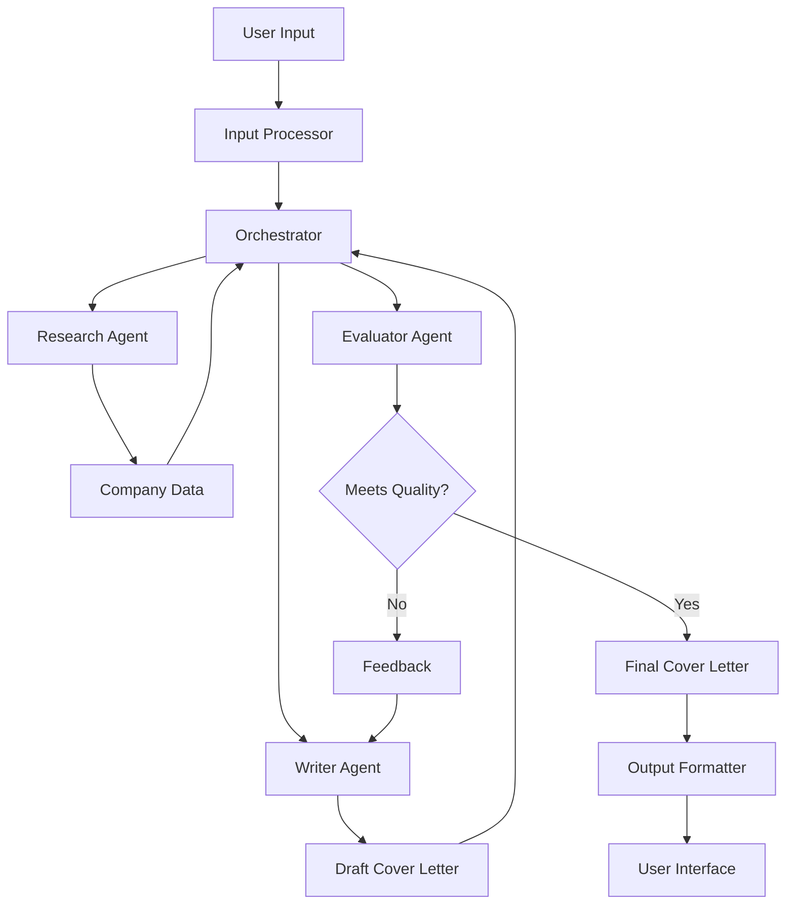

# Cover Letter Generation Agent

An agentic system that automates the creation of personalized cover letters by leveraging AI-driven research, content drafting, and evaluation.

## Overview

The Cover Letter Generation Agent is a TypeScript application built with LangChain that helps job seekers create high-quality, personalized cover letters. The system uses three specialized agents working together:

1. **Research Agent**: Gathers company information and relevant insights
2. **Writer Agent**: Drafts the cover letter based on research and resume data
3. **Evaluator Agent**: Reviews the draft for quality and relevance

The system follows an orchestrator-workers pattern, where the orchestrator coordinates the workflow between these specialized agents.

## Features

- **Resume Parsing**: Support for PDF, DOCX, and JSON resume formats
- **Company Research**: Automated gathering of company information using Bing Search and Perplexity APIs
- **Personalized Content**: Generation of tailored cover letters based on the candidate's resume and company research
- **Quality Evaluation**: Automated review of cover letters for relevance, personalization, clarity, and impact
- **Iterative Refinement**: Feedback loop for improving drafts that don't meet quality standards
- **Multiple Tone Options**: Support for formal, conversational, enthusiastic, or balanced tones

## Architecture

The system is built using a modular architecture with the following components:



## Technology Stack

- **Language**: TypeScript
- **Framework**: Node.js with Express
- **LLM Orchestration**: LangChain.js
- **LLM Provider**: OpenAI GPT
- **Search APIs**: Bing Search API, Perplexity API
- **Document Processing**: pdf-parse (for PDFs), mammoth (for DOCX)
- **Testing**: Jest
- **Containerization**: Docker
- **CI/CD**: GitHub Actions

## Getting Started

### Prerequisites

- Node.js (v18 or higher)
- API keys for:
  - OpenAI
  - Bing Search
  - Perplexity

### Installation

1. Clone the repository:

   ```bash
   git clone https://github.com/yourusername/cover-letter-agent.git
   cd cover-letter-agent
   ```

2. Install dependencies:

   ```bash
   npm install
   ```

3. Create a `.env` file based on `.env.example`:

   ```bash
   cp .env.example .env
   # Edit .env to add your API keys
   ```

4. Build the project:
   ```bash
   npm run build
   ```

### Running the Application

Start the development server:

```bash
npm run dev
```

The API will be available at `http://localhost:3000`.

### API Usage

#### Generate a Cover Letter

```bash
curl -X POST http://localhost:3000/api/generate-cover-letter \
  -H "Content-Type: application/json" \
  -d '{
    "resume": {
      "personalInfo": {
        "name": "John Doe",
        "email": "john@example.com"
      },
      "experience": [
        {
          "title": "Software Engineer",
          "company": "Tech Corp",
          "description": "Developed web applications"
        }
      ],
      "education": [
        {
          "degree": "Computer Science",
          "institution": "University"
        }
      ],
      "skills": ["JavaScript", "TypeScript"]
    },
    "companyName": "Example Inc",
    "jobTitle": "Senior Developer",
    "jobDescription": "We are looking for a senior developer with experience in TypeScript and Node.js.",
    "tonePreference": "conversational"
  }'
```

You can also upload a resume file using multipart/form-data:

```bash
curl -X POST http://localhost:3000/api/generate-cover-letter \
  -F "resume=@/path/to/resume.pdf" \
  -F "companyName=Example Inc" \
  -F "jobTitle=Senior Developer" \
  -F "jobDescription=We are looking for a senior developer with experience in TypeScript and Node.js." \
  -F "tonePreference=conversational"
```

## Development

### Project Structure

See [project_structure.md](project_structure.md) for details on the project structure.

### Running Tests

```bash
# Run all tests
npm test

# Run tests in watch mode
npm run test:watch
```

### Linting

```bash
# Run linter
npm run lint

# Fix linting issues
npm run lint:fix
```

## Deployment

### Using Docker

1. Build the Docker image:

   ```bash
   docker build -t cover-letter-agent .
   ```

2. Run the container:
   ```bash
   docker run -p 3000:3000 --env-file .env cover-letter-agent
   ```

### Using Docker Compose

```bash
docker-compose up
```

## License

This project is licensed under the MIT License - see the LICENSE file for details.

## Acknowledgments

- LangChain for providing the framework for building LLM applications
- OpenAI for the GPT models
- Bing Search and Perplexity for research capabilities
