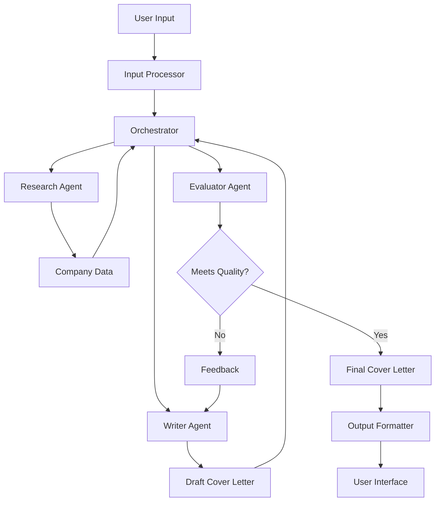

# Cover Letter Generation Agent

An agentic system that automates the creation of personalized cover letters by leveraging AI-driven research, content drafting, and evaluation.

## Overview

The Cover Letter Generation Agent is a TypeScript application built with LangChain that helps job seekers create high-quality, personalized cover letters. The system uses three specialized agents working together:

1. **Research Agent**: Gathers company information and relevant insights
2. **Writer Agent**: Drafts the cover letter based on research and resume data
3. **Evaluator Agent**: Reviews the draft for quality and relevance

The system follows an orchestrator-workers pattern, where the orchestrator coordinates the workflow between these specialized agents.

## Features

- **Resume Parsing**: Support for PDF, DOCX, and JSON resume formats
- **Company Research**: Automated gathering of company information using Bing Search and Perplexity APIs
- **Personalized Content**: Generation of tailored cover letters based on the candidate's resume and company research
- **Quality Evaluation**: Automated review of cover letters for relevance, personalization, clarity, and impact
- **Iterative Refinement**: Feedback loop for improving drafts that don't meet quality standards
- **Multiple Tone Options**: Support for formal, conversational, enthusiastic, or balanced tones

## Architecture

The system is built using a modular architecture with the following components:



## Technology Stack

- **Language**: TypeScript
- **Framework**: Node.js with Express
- **LLM Orchestration**: LangChain.js
- **LLM Provider**: OpenAI GPT
- **Search APIs**: Bing Search API, Perplexity API
- **Document Processing**: pdf-parse (for PDFs), mammoth (for DOCX)
- **Testing**: Jest
- **Containerization**: Docker
- **CI/CD**: GitHub Actions

## Getting Started

### Prerequisites

- Node.js (v18 or higher)
- API keys for:
  - OpenAI
  - Bing Search
  - Perplexity

### Installation

1. Clone the repository:

   ```bash
   git clone https://github.com/yourusername/cover-letter-agent.git
   cd cover-letter-agent
   ```

2. Install dependencies:

   ```bash
   npm install
   ```

3. Create a `.env` file based on `.env.example`:

   ```bash
   cp .env.example .env
   # Edit .env to add your API keys
   ```

4. Build the project:
   ```bash
   npm run build
   ```

### Running the Application

Start the development server:

```bash
npm run dev
```

The API will be available at `http://localhost:3000`.

### API Usage

#### Generate a Cover Letter

```bash
curl -X POST http://localhost:3000/api/generate-cover-letter \
  -H "Content-Type: application/json" \
  -d '{
    "resume": {
      "personalInfo": {
        "name": "John Doe",
        "email": "john@example.com"
      },
      "experience": [
        {
          "title": "Software Engineer",
          "company": "Tech Corp",
          "description": "Developed web applications"
        }
      ],
      "education": [
        {
          "degree": "Computer Science",
          "institution": "University"
        }
      ],
      "skills": ["JavaScript", "TypeScript"]
    },
    "companyName": "Example Inc",
    "jobTitle": "Senior Developer",
    "jobDescription": "We are looking for a senior developer with experience in TypeScript and Node.js.",
    "tonePreference": "conversational"
  }'
```

You can also upload a resume file using multipart/form-data:

```bash
curl -X POST http://localhost:3000/api/generate-cover-letter \
  -F "resume=@/path/to/resume.pdf" \
  -F "companyName=Example Inc" \
  -F "jobTitle=Senior Developer" \
  -F "jobDescription=We are looking for a senior developer with experience in TypeScript and Node.js." \
  -F "tonePreference=conversational"
```

##### Example

I took the example from the [ZipRecruiter job posting](https://www.ziprecruiter.com/job/f9c50268) I just found the job description copy and pasted it into the jobDescription field. I also was in the same directory as the resume file so I just used the filename. NOTE make sure there was no Quotes (") in the job description or it will break the API call, just remove them if there are any.

```bash
Downloads curl -X POST http://localhost:3000/api/generate-cover-letter \
  -F "resume=@Martin_travis_ats.docx" \
  -F "companyName=ZipRecruiter" \
  -F "jobTitle=Software Engineer, Full Stack" \
  -F "jobDescription=Job description
We offer a hybrid work environment. Most US-based positions can also be performed remotely (any exceptions will be noted in the Minimum Qualifications below.)

Our Mission:

To actively connect people to their next great opportunity.

Who We Are:

ZipRecruiter is a leading online employment marketplace. Powered by AI-driven smart matching technology, the company actively connects millions of all-sized businesses and job seekers through innovative mobile, web, and email services, as well as through partnerships with the best job boards on the web. ZipRecruiter has the #1 rated job search app on iOS & Android.

About the Team:

Our team has a unique opportunity to work on applications at scale, serving millions of jobseekers and tens of thousands of customers. We're working on building an efficient marketplace of jobseekers and employers and need full-stack engineers to build fast, scalable, and effective applications that help connect people to their next job. We provide an essential service and have a thriving business as a result.

Our stack is complex and we're looking for engineers who know how to write evolvable, properly instrumented, and efficient code as part of a growing distributed system. We're worki [....]
```

```json
{"success":true,"data":{"coverLetter":"[Your Address]  \n[City, State, ZIP Code]  \n[Email Address]  \n[Phone Number]  \n\n[Date]  \n\nHiring Manager  \nZipRecruiter  \n[Company Address]  \n[City, State, ZIP Code]  \n\nDear Hiring Manager,\n\nI am writing to express my enthusiasm for the Software Engineer, Full Stack position at ZipRecruiter, as advertised. With a Bachelor of Computer Science from the University of New Brunswick and extensive experience in both frontend and backend development, I am excited about the opportunity to contribute to your innovative team that is dedicated to connecting people with their next great opportunity.\n\nThroughout my career, I have developed a strong proficiency in a variety of programming languages and technologies that align with ZipRecruiter's technical stack, including Java, Golang, JavaScript, Node.js, ReactJs, and Kubernetes. My experience at IBM Canada and POSTILIZE has equipped me with the skills to design and implement scalable user-facing applications that can seamlessly expand to accommodate a diverse user base. Additionally, my expertise in OpenShift, AWS, and Kafka has enabled me to build and maintain robust distributed systems, ensuring high performance and reliability.\n\nI am particularly drawn to ZipRecruiter’s commitment to innovation and the use of AI-driven smart matching technology to enhance user experiences. My experience with test-driven development and object-oriented design has cultivated a strong foundation for delivering efficient and evolvable code, which I am eager to apply in developing fast and intuitive mobile-first web applications at ZipRecruiter. I am especially impressed by your emphasis on diversity and inclusion, values that resonate with my own professional ethos and which I believe are critical to fostering a collaborative and innovative work environment.\n\nI am eager to bring my skills in full-stack development to ZipRecruiter and contribute to your mission of creating an efficient marketplace that serves millions of job seekers and employers. I would welcome the opportunity to discuss how my background, skills, and enthusiasms align with the goals of your team. Thank you for considering my application. I look forward to the possibility of discussing this exciting opportunity with you.\n\nSincerely,\n\nTravis Martin\n\n[Attachment: Resume]","metadata":{"model":"gpt-4o-2024-08-06","tokenUsage":{"promptTokens":1468,"completionTokens":428,"totalTokens":1896},"generationTime":9797},"companyResearchUsed":true}}%
```

## Development

### Project Structure

See [project_structure.md](project_structure.md) for details on the project structure.

### Running Tests

```bash
# Run all tests
npm test

# Run tests in watch mode
npm run test:watch
```

### Linting

```bash
# Run linter
npm run lint

# Fix linting issues
npm run lint:fix
```

## Deployment

### Using Docker

1. Build the Docker image:

   ```bash
   docker build -t cover-letter-agent .
   ```

2. Run the container:
   ```bash
   docker run -p 3000:3000 --env-file .env cover-letter-agent
   ```

### Using Docker Compose

```bash
docker-compose up
```

## License

This project is licensed under the MIT License - see the LICENSE file for details.

## Acknowledgments

- LangChain for providing the framework for building LLM applications
- OpenAI for the GPT models
- Bing Search and Perplexity for research capabilities
