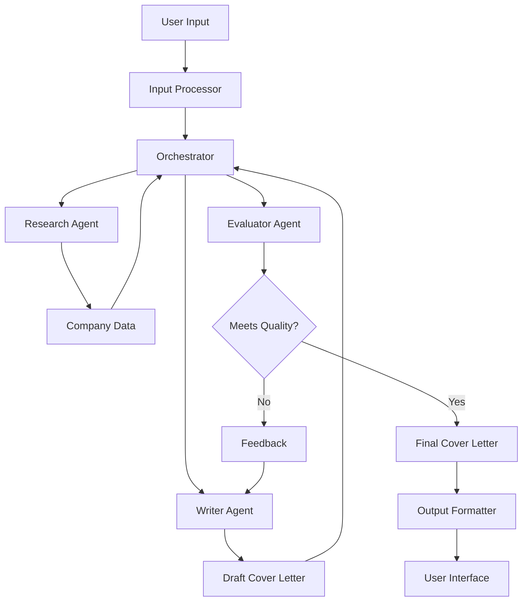

# Cover Letter Generation Agent

An agentic system that automates the creation of personalized cover letters by leveraging AI-driven research, content drafting, and evaluation.

## Overview

The Cover Letter Generation Agent is a TypeScript application built with LangChain that helps job seekers create high-quality, personalized cover letters. The system uses three specialized agents working together:

1. **Research Agent**: Gathers company information and relevant insights
2. **Writer Agent**: Drafts the cover letter based on research and resume data
3. **Evaluator Agent**: Reviews the draft for quality and relevance

The system follows an orchestrator-workers pattern, where the orchestrator coordinates the workflow between these specialized agents.

## Features

- **Resume Parsing**: Support for PDF, DOCX, and JSON resume formats
- **Company Research**: Automated gathering of company information using Bing Search and Perplexity APIs
- **Personalized Content**: Generation of tailored cover letters based on the candidate's resume and company research
- **Quality Evaluation**: Automated review of cover letters for relevance, personalization, clarity, and impact
- **Iterative Refinement**: Feedback loop for improving drafts that don't meet quality standards
- **Multiple Tone Options**: Support for formal, conversational, enthusiastic, or balanced tones
- **Multiple Cover Letter Approaches**: Generate multiple cover letters with different styles and approaches:
  - **Achievement-Focused**: Emphasizes specific achievements and measurable results
  - **Company Culture Match**: Highlights alignment with company values and culture
  - **Skills Highlight**: Clearly maps candidate skills to job requirements
  - **Requirements Table**: Uses a table format to match job requirements with qualifications
  - **Custom Template**: Adapts a previously successful cover letter template to the current job
- **Interview Preparation**: Generate tailored interview preparation materials:
  - **Customized Questions**: Technical, cultural, and company-specific questions
  - **Suggested Answers**: Guidance on how to answer the generated questions
  - **Talking Points**: Topics to discuss during the interview
  - **Preparation Checklist**: Tasks to complete before the interview

## Architecture

The system is built using a modular architecture with the following components:



## Technology Stack

- **Language**: TypeScript
- **Framework**: Node.js with Express
- **LLM Orchestration**: LangChain.js
- **LLM Provider**: OpenAI GPT
- **Search APIs**: Bing Search API, Perplexity API
- **Document Processing**: pdf-parse (for PDFs), mammoth (for DOCX)
- **Testing**: Jest
- **Containerization**: Docker
- **CI/CD**: GitHub Actions

## Getting Started

### Prerequisites

- Node.js (v18 or higher)
- API keys for:
  - OpenAI
  - Bing Search
  - Perplexity

### Installation

1. Clone the repository:

   ```bash
   git clone https://github.com/yourusername/cover-letter-agent.git
   cd cover-letter-agent
   ```

2. Install dependencies:

   ```bash
   npm install
   ```

3. Create a `.env` file based on `.env.example`:

   ```bash
   cp .env.example .env
   # Edit .env to add your API keys
   ```

4. Build the project:
   ```bash
   npm run build
   ```

### Running the Application

Start the development server:

```bash
npm run dev
```

The API will be available at `http://localhost:3000`.

### API Usage

#### Generate a Cover Letter

```bash
curl -X POST http://localhost:3000/api/generate-cover-letter \
  -H "Content-Type: application/json" \
  -d '{
    "resume": {
      "personalInfo": {
        "name": "John Doe",
        "email": "john@example.com"
      },
      "experience": [
        {
          "title": "Software Engineer",
          "company": "Tech Corp",
          "description": "Developed web applications"
        }
      ],
      "education": [
        {
          "degree": "Computer Science",
          "institution": "University"
        }
      ],
      "skills": ["JavaScript", "TypeScript"]
    },
    "companyName": "Example Inc",
    "jobTitle": "Senior Developer",
    "jobDescription": "We are looking for a senior developer with experience in TypeScript and Node.js.",
    "tonePreference": "conversational"
  }'
```

#### Generate Multiple Cover Letters

To generate multiple cover letters with different approaches:

```bash
curl -X POST http://localhost:3000/api/generate-cover-letter \
  -H "Content-Type: application/json" \
  -d '{
    "resume": {
      "personalInfo": {
        "name": "John Doe",
        "email": "john@example.com"
      },
      "experience": [
        {
          "title": "Software Engineer",
          "company": "Tech Corp",
          "description": "Developed web applications"
        }
      ],
      "education": [
        {
          "degree": "Computer Science",
          "institution": "University"
        }
      ],
      "skills": ["JavaScript", "TypeScript"]
    },
    "companyName": "Example Inc",
    "jobTitle": "Senior Developer",
    "jobDescription": "We are looking for a senior developer with experience in TypeScript and Node.js.",
    "tonePreference": "PROFESSIONAL",
    "generateMultiple": true,
    "approaches": ["REQUIREMENTS_TABLE", "ACHIEVEMENT_FOCUSED"]
  }'
```

You can also use a custom template from a previously successful cover letter:

```bash
curl -X POST http://localhost:3000/api/generate-cover-letter \
  -H "Content-Type: application/json" \
  -d '{
    "resume": { ... },
    "companyName": "Example Inc",
    "jobTitle": "Senior Developer",
    "jobDescription": "We are looking for a senior developer...",
    "tonePreference": "PROFESSIONAL",
    "generateMultiple": true,
    "approaches": ["CUSTOM_TEMPLATE", "SKILLS_HIGHLIGHT"],
    "customTemplate": "Dear Hiring Manager,\n\nI am writing to express my interest in the [Position] role at [Company]...\n\nSincerely,\n[Your Name]"
  }'
```

The response will include multiple cover letters with their respective approaches:

```json
{
  "success": true,
  "data": {
    "coverLetters": [
      {
        "coverLetter": "...",
        "approach": "REQUIREMENTS_TABLE",
        "metadata": { ... }
      },
      {
        "coverLetter": "...",
        "approach": "ACHIEVEMENT_FOCUSED",
        "metadata": { ... }
      }
    ],
    "companyResearchUsed": true
  }
}
```

You can also upload a resume file using multipart/form-data:

```bash
curl -X POST http://localhost:3000/api/generate-cover-letter \
  -F "resume=@/path/to/resume.pdf" \
  -F "companyName=Example Inc" \
  -F "jobTitle=Senior Developer" \
  -F "jobDescription=We are looking for a senior developer with experience in TypeScript and Node.js." \
  -F "tonePreference=conversational"
```

For generating multiple cover letters with a file upload:

```bash
curl -X POST http://localhost:3000/api/generate-cover-letter \
  -F "resume=@/path/to/resume.pdf" \
  -F "companyName=Example Inc" \
  -F "jobTitle=Senior Developer" \
  -F "jobDescription=We are looking for a senior developer with experience in TypeScript and Node.js." \
  -F "tonePreference=PROFESSIONAL" \
  -F "generateMultiple=true" \
  -F "approaches[]=REQUIREMENTS_TABLE" \
  -F "approaches[]=ACHIEVEMENT_FOCUSED"
```

To use a custom template with a file upload:

```bash
curl -X POST http://localhost:3000/api/generate-cover-letter \
  -F "resume=@/path/to/resume.pdf" \
  -F "companyName=Example Inc" \
  -F "jobTitle=Senior Developer" \
  -F "jobDescription=We are looking for a senior developer with experience in TypeScript and Node.js." \
  -F "tonePreference=PROFESSIONAL" \
  -F "generateMultiple=true" \
  -F "approaches[]=CUSTOM_TEMPLATE" \
  -F "approaches[]=SKILLS_HIGHLIGHT" \
  -F "customTemplate=Dear Hiring Manager,\n\nI am writing to express my interest in the [Position] role at [Company]...\n\nSincerely,\n[Your Name]"
```

#### Using Interview Preparation Feature

The system can generate tailored interview preparation materials to help you prepare for job interviews.

##### Standalone Interview Preparation

To generate interview preparation materials without a cover letter:

```bash
curl -X POST http://localhost:3000/api/interview-prep \
  -H "Content-Type: application/json" \
  -d '{
    "companyName": "Example Inc",
    "jobDescription": "We are looking for a senior developer with experience in TypeScript and Node.js. The ideal candidate will have 5+ years of experience in full-stack development and a strong understanding of cloud architecture.",
    "options": {
      "questionCount": 5,
      "includeSuggestedAnswers": true,
      "difficultyLevel": "intermediate",
      "focusAreas": ["technical", "cultural", "company-specific"]
    }
  }'
```

The response will include tailored interview questions, suggested answers, talking points, and a preparation checklist:

```json
{
  "success": true,
  "data": {
    "questions": [
      {
        "type": "technical",
        "content": "Can you explain how TypeScript interfaces differ from types?",
        "difficulty": "intermediate",
        "suggestedAnswer": "TypeScript interfaces are a way to define object shapes..."
      }
      // More questions...
    ],
    "talkingPoints": [
      {
        "topic": "Example Inc's recent cloud migration project",
        "discussionAngles": [
          "How does the company handle technical debt during migrations?",
          "What cloud providers are currently being used?"
        ]
      }
      // More talking points...
    ],
    "checklist": [
      {
        "category": "research",
        "task": "Review Example Inc's tech blog for recent projects",
        "priority": "high"
      }
      // More checklist items...
    ],
    "companyInsights": {
      "cultureHighlights": [
        "Strong emphasis on work-life balance",
        "Collaborative team environment"
      ]
      // More insights...
    }
  }
}
```

##### Interview Preparation with Cover Letter

You can request interview preparation materials as part of the cover letter generation process. Here are examples ranging from simple to advanced configurations:

###### Basic Example (Minimal Options)

```bash
curl -X POST http://localhost:3000/api/cover-letter \
  -H "Content-Type: application/json" \
  -d '{
    "resume": { ... },
    "companyName": "Example Inc",
    "jobTitle": "Senior Developer",
    "jobDescription": "We are looking for a senior developer with experience in TypeScript and Node.js.",
    "tonePreference": "PROFESSIONAL",
    "includeInterviewPrep": true
  }'
```

This basic example will use the default interview prep options:

- 10 questions
- Mixed difficulty level
- Includes suggested answers
- Covers technical, cultural, and company-specific questions

###### Intermediate Example (Custom Question Count and Answer Options)

```bash
curl -X POST http://localhost:3000/api/cover-letter \
  -H "Content-Type: application/json" \
  -d '{
    "resume": { ... },
    "companyName": "Example Inc",
    "jobTitle": "Senior Developer",
    "jobDescription": "We are looking for a senior developer with experience in TypeScript and Node.js.",
    "tonePreference": "PROFESSIONAL",
    "includeInterviewPrep": true,
    "interviewPrepOptions": {
      "questionCount": 5,
      "includeSuggestedAnswers": true
    }
  }'
```

###### Advanced Example (All Options)

```bash
curl -X POST http://localhost:3000/api/cover-letter \
  -H "Content-Type: application/json" \
  -d '{
    "resume": { ... },
    "companyName": "Example Inc",
    "jobTitle": "Senior Developer",
    "jobDescription": "We are looking for a senior developer with experience in TypeScript and Node.js. The ideal candidate will have 5+ years of experience in full-stack development and a strong understanding of cloud architecture. Experience with AWS, Docker, and CI/CD pipelines is required.",
    "tonePreference": "PROFESSIONAL",
    "generateMultiple": true,
    "approaches": ["SKILLS_HIGHLIGHT", "ACHIEVEMENT_FOCUSED"],
    "includeInterviewPrep": true,
    "interviewPrepOptions": {
      "questionCount": 15,
      "includeSuggestedAnswers": true,
      "difficultyLevel": "advanced",
      "focusAreas": ["technical", "cultural"],
      "forceRefresh": true
    }
  }'
```

This advanced example:

1. Generates multiple cover letters with different approaches
2. Includes comprehensive interview preparation materials
3. Customizes the interview prep with:
   - 15 questions (higher than default)
   - Advanced difficulty level
   - Focus on technical and cultural questions (excluding company-specific)
   - Forces a refresh of cached interview prep data
   - Includes suggested answers for all questions

###### Advanced Example with File Upload (All Options)

```bash
curl -X POST http://localhost:3000/api/cover-letter \
  -F "resume=@/path/to/resume.pdf" \
  -F "companyName=Example Inc" \
  -F "jobTitle=Senior Developer" \
  -F "jobDescription=We are looking for a senior developer with experience in TypeScript and Node.js. The ideal candidate will have 5+ years of experience in full-stack development and a strong understanding of cloud architecture." \
  -F "tonePreference=PROFESSIONAL" \
  -F "generateMultiple=true" \
  -F "approaches[]=SKILLS_HIGHLIGHT" \
  -F "approaches[]=ACHIEVEMENT_FOCUSED" \
  -F "includeInterviewPrep=true" \
  -F "interviewPrepOptions[questionCount]=15" \
  -F "interviewPrepOptions[includeSuggestedAnswers]=true" \
  -F "interviewPrepOptions[difficultyLevel]=advanced" \
  -F "interviewPrepOptions[focusAreas][]=technical" \
  -F "interviewPrepOptions[focusAreas][]=cultural" \
  -F "interviewPrepOptions[forceRefresh]=true"
```

The response will include both the cover letters and interview preparation materials:

```json
{
  "success": true,
  "data": {
    "coverLetters": [
      {
        "coverLetter": "...",
        "approach": "SKILLS_HIGHLIGHT",
        "evaluation": {
          "grammar": {
            "score": 9.5,
            "feedback": "The grammar and style are excellent..."
          },
          "relevance": {
            "score": 9.2,
            "feedback": "The cover letter effectively addresses the job requirements..."
          },
          "completeness": {
            "score": 9.0,
            "feedback": "All essential components are present..."
          },
          "overall": {
            "score": 9.2,
            "summary": "This is a high-quality cover letter that effectively showcases the candidate's skills..."
          }
        }
      },
      {
        "coverLetter": "...",
        "approach": "ACHIEVEMENT_FOCUSED",
        "evaluation": { ... }
      }
    ],
    "companyResearch": {
      "companyInfo": {
        "name": "Example Inc",
        "description": "Example Inc is a leading technology company...",
        "industry": "Software Development",
        "founded": "2010",
        "headquarters": "San Francisco, CA",
        "employees": "500-1000"
      },
      "companyValues": [
        "Innovation",
        "Collaboration",
        "Customer-focus"
      ],
      "recentNews": [
        {
          "title": "Example Inc Launches New Cloud Platform",
          "date": "2025-02-15",
          "summary": "Example Inc announced the launch of their new cloud platform..."
        }
      ]
    },
    "interviewPrep": {
      "questions": [
        {
          "type": "technical",
          "content": "Explain how you would design a scalable microservice architecture using TypeScript and Node.js.",
          "difficulty": "advanced",
          "relevance": {
            "jobRole": true,
            "companyValues": true,
            "industryTrends": true
          },
          "suggestedAnswer": "When designing a scalable microservice architecture with TypeScript and Node.js, I would start by identifying clear domain boundaries to ensure each service has a single responsibility. I'd implement API gateways to handle cross-cutting concerns like authentication and rate limiting. For communication between services, I'd use both synchronous (REST/GraphQL) and asynchronous (message queues like RabbitMQ or Kafka) methods depending on the use case. For data management, I'd follow the database-per-service pattern using the appropriate database type for each service's needs. I'd containerize each service with Docker and orchestrate with Kubernetes for deployment, scaling, and management. For observability, I'd implement distributed tracing with tools like Jaeger, centralized logging with the ELK stack, and metrics collection with Prometheus. Finally, I'd set up CI/CD pipelines to automate testing and deployment, ensuring each service can be developed and deployed independently.",
          "followUpQuestions": [
            "How would you handle data consistency across microservices?",
            "What strategies would you use to test microservices?"
          ]
        },
        // More technical questions...
        {
          "type": "cultural",
          "content": "Example Inc values innovation. Can you describe a time when you introduced an innovative solution to a complex problem?",
          "difficulty": "advanced",
          "relevance": {
            "jobRole": false,
            "companyValues": true,
            "industryTrends": false
          },
          "suggestedAnswer": "At my previous company, we were facing significant performance issues with our data processing pipeline that was handling millions of records daily. After analyzing the bottlenecks, I proposed and implemented a complete redesign using a stream processing architecture with Apache Kafka. This innovative approach reduced processing time by 80% and improved system reliability. The solution was so effective that it was adopted across other teams and became a company standard for high-volume data processing. This experience taught me that sometimes the most innovative solutions come from questioning fundamental assumptions about how systems should work."
        },
        // More cultural questions...
      ],
      "talkingPoints": [
        {
          "topic": "Example Inc's new cloud platform",
          "context": "Recently launched product that represents a strategic direction for the company",
          "relevantNews": ["Example Inc Launches New Cloud Platform"],
          "keyStats": ["Expected to grow company revenue by 30%"],
          "discussionAngles": [
            "How does this platform differentiate from competitors?",
            "What technologies power the platform?",
            "How does the company plan to scale the platform?"
          ]
        },
        // More talking points...
      ],
      "checklist": [
        {
          "category": "research",
          "task": "Review Example Inc's technical blog posts about their cloud architecture",
          "priority": "high",
          "timeframe": "3-5 days before interview",
          "resources": ["https://blog.exampleinc.com/tech"]
        },
        {
          "category": "preparation",
          "task": "Prepare a portfolio of relevant TypeScript/Node.js projects",
          "priority": "high",
          "timeframe": "1 week before interview",
          "resources": ["GitHub repositories", "Live demos"]
        },
        // More checklist items...
      ],
      "companyInsights": {
        "cultureHighlights": [
          "Strong emphasis on continuous learning",
          "Regular hackathons to encourage innovation",
          "Flexible work arrangements with focus on results"
        ],
        "recentDevelopments": [
          "Expansion into European markets",
          "Acquisition of AI startup TechMinds",
          "Launch of developer advocacy program"
        ],
        "challengesOpportunities": [
          "Facing increased competition in cloud services market",
          "Opportunity to leverage AI/ML for product differentiation",
          "Challenge of scaling engineering team while maintaining culture"
        ]
      }
    }
  }
}
```

##### Example

I took the example from the [ZipRecruiter job posting](https://www.ziprecruiter.com/job/f9c50268) I just found the job description copy and pasted it into the jobDescription field. I also was in the same directory as the resume file so I just used the filename. NOTE make sure there was no Quotes (") in the job description or it will break the API call, just remove them if there are any.

```bash
Downloads curl -X POST http://localhost:3000/api/generate-cover-letter \
  -F "resume=@Martin_travis_ats.docx" \
  -F "companyName=ZipRecruiter" \
  -F "jobTitle=Software Engineer, Full Stack" \
  -F "jobDescription=Job description
We offer a hybrid work environment. Most US-based positions can also be performed remotely (any exceptions will be noted in the Minimum Qualifications below.)

Our Mission:

To actively connect people to their next great opportunity.

Who We Are:

ZipRecruiter is a leading online employment marketplace. Powered by AI-driven smart matching technology, the company actively connects millions of all-sized businesses and job seekers through innovative mobile, web, and email services, as well as through partnerships with the best job boards on the web. ZipRecruiter has the #1 rated job search app on iOS & Android.

About the Team:

Our team has a unique opportunity to work on applications at scale, serving millions of jobseekers and tens of thousands of customers. We're working on building an efficient marketplace of jobseekers and employers and need full-stack engineers to build fast, scalable, and effective applications that help connect people to their next job. We provide an essential service and have a thriving business as a result.

Our stack is complex and we're looking for engineers who know how to write evolvable, properly instrumented, and efficient code as part of a growing distributed system. We're worki [....]
```

```json
{"success":true,"data":{"coverLetter":"[Your Address]  \n[City, State, ZIP Code]  \n[Email Address]  \n[Phone Number]  \n\n[Date]  \n\nHiring Manager  \nZipRecruiter  \n[Company Address]  \n[City, State, ZIP Code]  \n\nDear Hiring Manager,\n\nI am writing to express my enthusiasm for the Software Engineer, Full Stack position at ZipRecruiter, as advertised. With a Bachelor of Computer Science from the University of New Brunswick and extensive experience in both frontend and backend development, I am excited about the opportunity to contribute to your innovative team that is dedicated to connecting people with their next great opportunity.\n\nThroughout my career, I have developed a strong proficiency in a variety of programming languages and technologies that align with ZipRecruiter's technical stack, including Java, Golang, JavaScript, Node.js, ReactJs, and Kubernetes. My experience at IBM Canada and POSTILIZE has equipped me with the skills to design and implement scalable user-facing applications that can seamlessly expand to accommodate a diverse user base. Additionally, my expertise in OpenShift, AWS, and Kafka has enabled me to build and maintain robust distributed systems, ensuring high performance and reliability.\n\nI am particularly drawn to ZipRecruiter's commitment to innovation and the use of AI-driven smart matching technology to enhance user experiences. My experience with test-driven development and object-oriented design has cultivated a strong foundation for delivering efficient and evolvable code, which I am eager to apply in developing fast and intuitive mobile-first web applications at ZipRecruiter. I am especially impressed by your emphasis on diversity and inclusion, values that resonate with my own professional ethos and which I believe are critical to fostering a collaborative and innovative work environment.\n\nI am eager to bring my skills in full-stack development to ZipRecruiter and contribute to your mission of creating an efficient marketplace that serves millions of job seekers and employers. I would welcome the opportunity to discuss how my background, skills, and enthusiasms align with the goals of your team. Thank you for considering my application. I look forward to the possibility of discussing this exciting opportunity with you.\n\nSincerely,\n\nTravis Martin\n\n[Attachment: Resume]","metadata":{"model":"gpt-4o-2024-08-06","tokenUsage":{"promptTokens":1468,"completionTokens":428,"totalTokens":1896},"generationTime":9797},"companyResearchUsed":true}}%
```

## Development

### Project Structure

See [project_structure.md](project_structure.md) for details on the project structure.

### Running Tests

```bash
# Run all tests
npm test

# Run tests in watch mode
npm run test:watch
```

### Linting

```bash
# Run linter
npm run lint

# Fix linting issues
npm run lint:fix
```

## Deployment

### Using Docker

1. Build the Docker image:

   ```bash
   docker build -t cover-letter-agent .
   ```

2. Run the container:
   ```bash
   docker run -p 3000:3000 --env-file .env cover-letter-agent
   ```

### Using Docker Compose

```bash
docker-compose up
```

## License

This project is licensed under the MIT License - see the LICENSE file for details.

## Acknowledgments

- LangChain for providing the framework for building LLM applications
- OpenAI for the GPT models
- Bing Search and Perplexity for research capabilities
