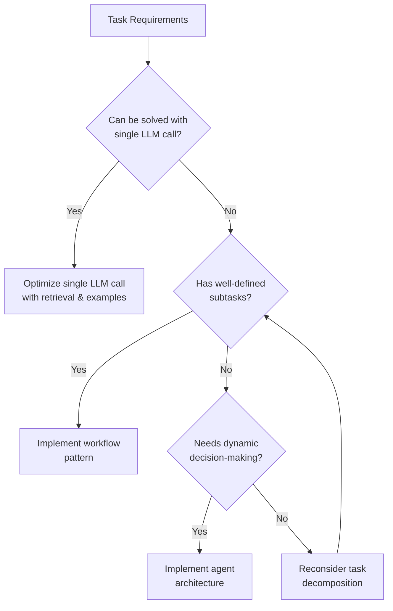
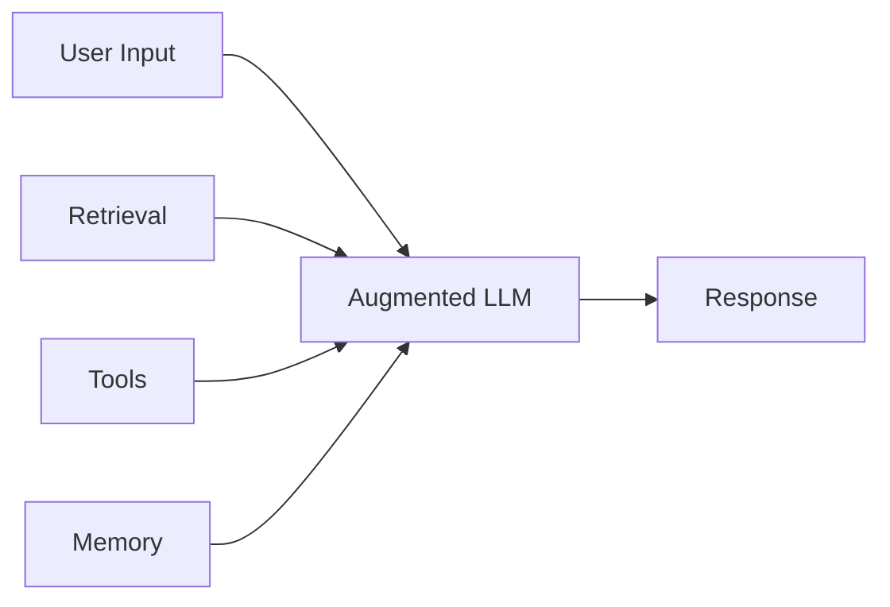
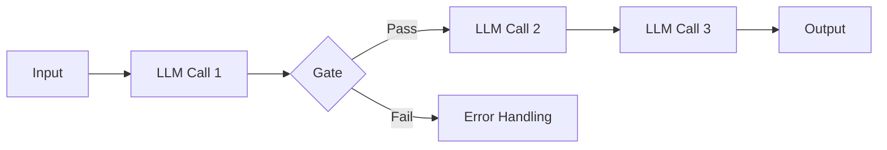
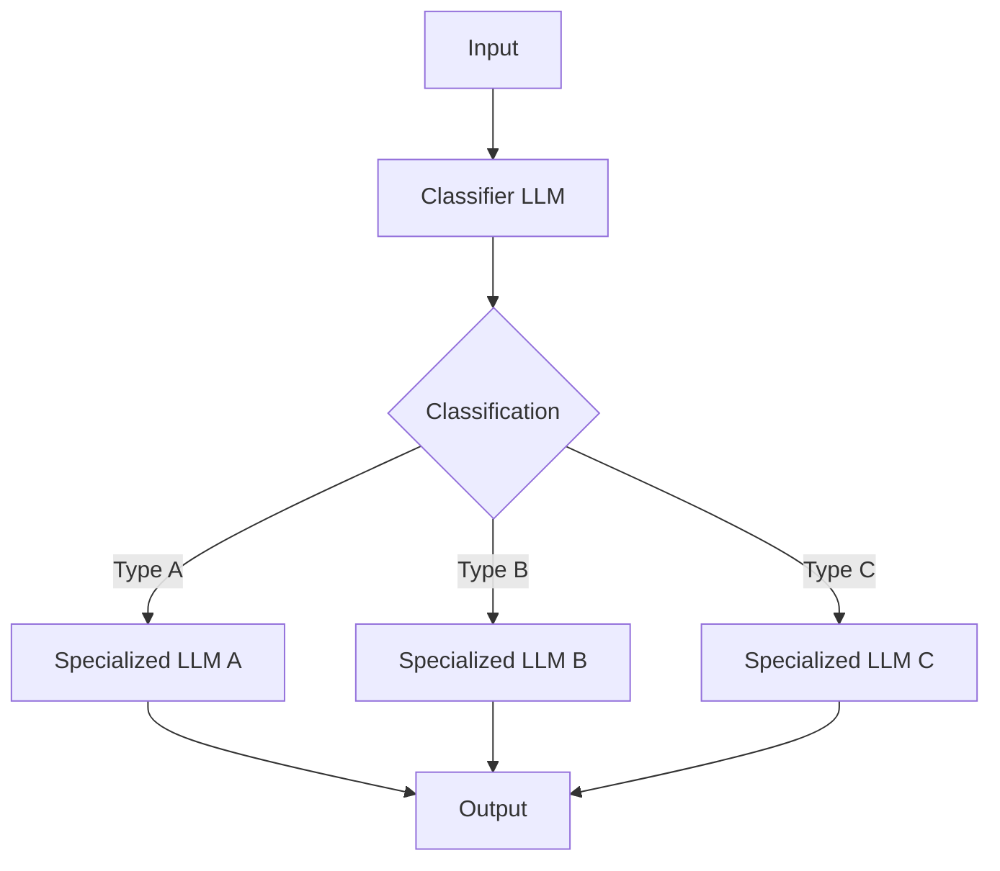
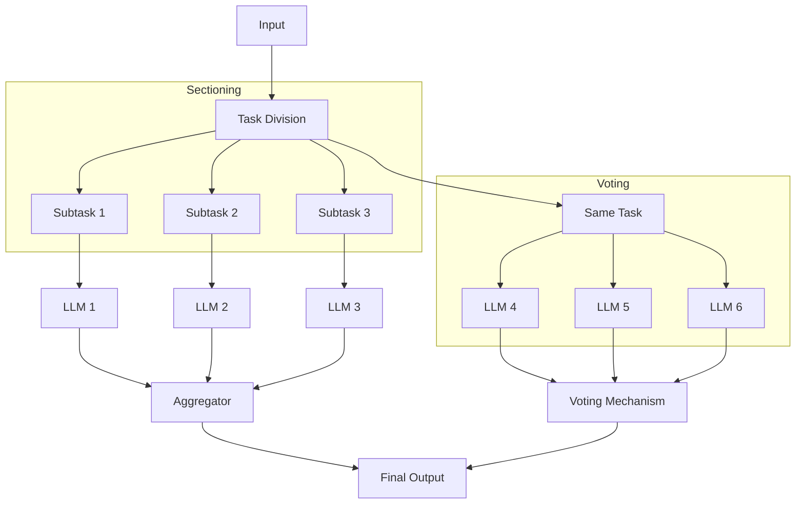
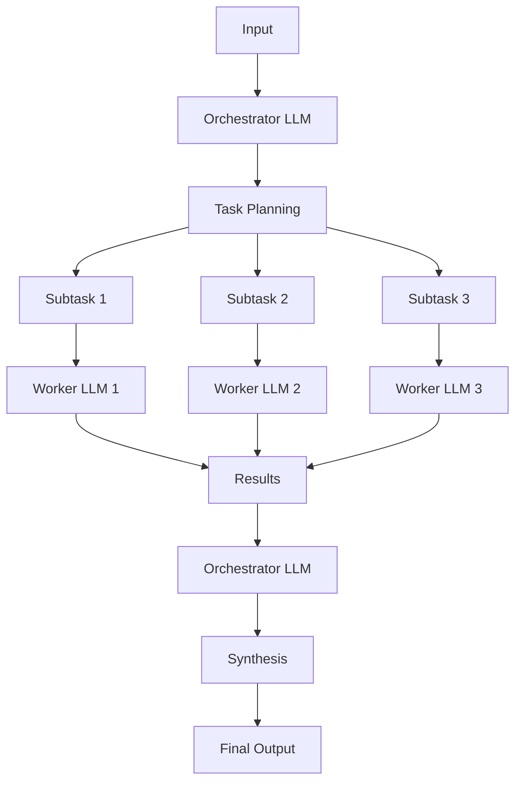
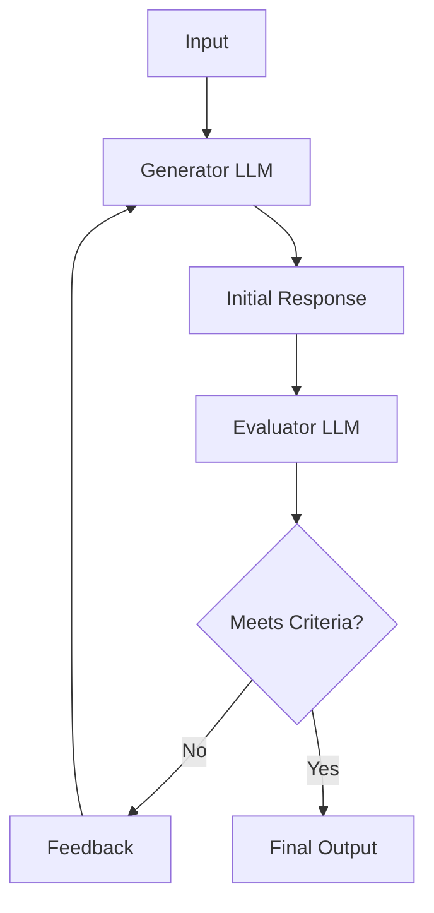
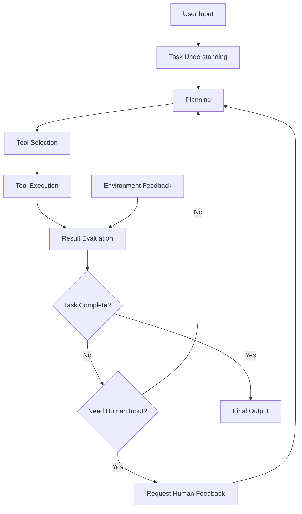
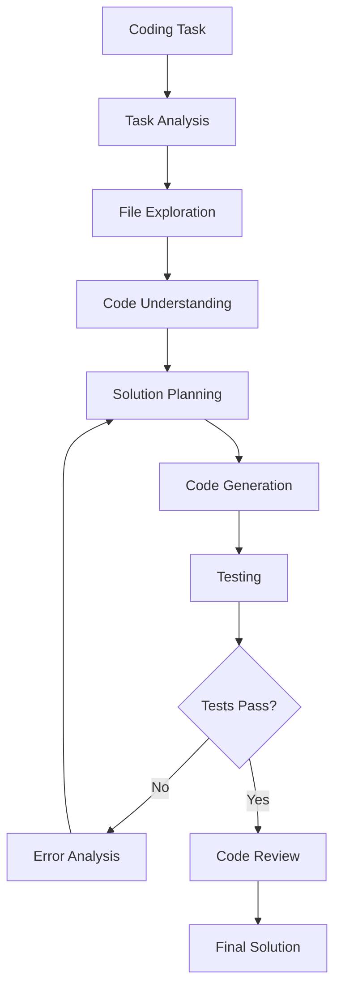

# Designing and Building Effective Agents and LLM Workflows

## Table of Contents

1. [Introduction](#introduction)
2. [Definitions](#definitions)
   - [What are Agents?](#what-are-agents)
   - [What are LLM Workflows?](#what-are-llm-workflows)
3. [When to Use Agents vs. Workflows](#when-to-use-agents-vs-workflows)
   - [Decision Framework](#decision-framework)
   - [Simplicity First Approach](#simplicity-first-approach)
4. [Frameworks and Tools](#frameworks-and-tools)
   - [Popular Frameworks](#popular-frameworks)
   - [Framework Considerations](#framework-considerations)
5. [Building Blocks](#building-blocks)
   - [The Augmented LLM](#the-augmented-llm)
6. [Workflow Patterns](#workflow-patterns)
   - [Prompt Chaining](#prompt-chaining)
   - [Routing](#routing)
   - [Parallelization](#parallelization)
   - [Orchestrator-Workers](#orchestrator-workers)
   - [Evaluator-Optimizer](#evaluator-optimizer)
7. [Autonomous Agents](#autonomous-agents)
   - [Agent Architecture](#agent-architecture)
   - [Implementation Considerations](#implementation-considerations)
8. [Combining Patterns](#combining-patterns)
9. [Practical Applications](#practical-applications)
   - [Customer Support](#customer-support)
   - [Coding Agents](#coding-agents)
10. [Tool Engineering for Agents](#tool-engineering-for-agents)
    - [Agent-Computer Interface (ACI)](#agent-computer-interface-aci)
    - [Best Practices](#best-practices)
11. [Conclusion](#conclusion)

## Introduction

This document provides a comprehensive guide to designing and building effective Large Language Model (LLM) agents and workflows. Based on practical experience working with numerous teams across industries, it outlines the most successful patterns and approaches for implementing LLM-powered systems.

The most effective implementations aren't necessarily the most complex ones. Instead, they rely on simple, composable patterns that can be combined and customized to meet specific needs. This guide will help you understand when to use different approaches and how to implement them effectively.

## Definitions

### What are Agents?

"Agent" can be defined in several ways, but at its core, an agent is a system where LLMs dynamically direct their own processes and tool usage, maintaining control over how they accomplish tasks. Agents have some level of autonomy in decision-making and can adapt their approach based on the specific context and feedback they receive.

Key characteristics of agents:

- Self-directed process flow
- Dynamic tool selection and usage
- Ability to plan and adapt strategies
- Potential for extended autonomous operation
- Feedback-driven improvement

### What are LLM Workflows?

Workflows are systems where LLMs and tools are orchestrated through predefined code paths. Unlike agents, workflows follow a more structured approach with clear steps and decision points defined by the developer.

Key characteristics of workflows:

- Predefined process flow
- Structured orchestration of LLMs and tools
- Developer-defined decision points
- Predictable behavior patterns
- Optimized for specific task types

## When to Use Agents vs. Workflows

### Decision Framework

The choice between agents and workflows depends on several factors:

| Factor               | Workflows               | Agents                  |
| -------------------- | ----------------------- | ----------------------- |
| Task predictability  | High                    | Low                     |
| Process structure    | Well-defined            | Flexible/emergent       |
| Decision complexity  | Simple/rule-based       | Complex/contextual      |
| Need for autonomy    | Low                     | High                    |
| Latency requirements | Lower (fewer steps)     | Higher (more steps)     |
| Cost considerations  | Lower (fewer API calls) | Higher (more API calls) |
| Error recovery       | Developer-defined       | Self-managed            |

### Simplicity First Approach

When building applications with LLMs, it's recommended to find the simplest solution possible and only increase complexity when needed:

1. **Start with single LLM calls** optimized with retrieval and in-context examples
2. **Add simple workflows** when tasks can be clearly decomposed
3. **Implement agents** only when flexibility and model-driven decision-making are needed at scale

Agentic systems often trade latency and cost for better task performance. This tradeoff should be carefully considered based on your specific requirements.

## Frameworks and Tools

### Popular Frameworks

Several frameworks make agentic systems easier to implement:

- **LangGraph** from LangChain
- **Amazon Bedrock's AI Agent** framework
- **Rivet** - a drag and drop GUI LLM workflow builder
- **Vellum** - another GUI tool for building and testing complex workflows

### Framework Considerations

While frameworks simplify implementation by handling standard low-level tasks like calling LLMs, defining and parsing tools, and chaining calls together, they come with tradeoffs:

**Advantages:**

- Faster development time
- Built-in abstractions for common patterns
- Community support and examples

**Disadvantages:**

- Extra layers of abstraction that can obscure underlying prompts and responses
- Potential debugging challenges
- May encourage unnecessary complexity

**Recommendation:** Start by using LLM APIs directly, as many patterns can be implemented in a few lines of code. If you do use a framework, ensure you understand the underlying code to avoid incorrect assumptions.

## Building Blocks

### The Augmented LLM

The basic building block of agentic systems is an LLM enhanced with augmentations such as retrieval, tools, and memory.

Key aspects to focus on:

1. **Tailoring capabilities** to your specific use case
2. **Providing an easy, well-documented interface** for your LLM

Implementation options include using the Model Context Protocol, which allows integration with a growing ecosystem of third-party tools.

## Workflow Patterns

### Prompt Chaining

Prompt chaining decomposes a task into a sequence of steps, where each LLM call processes the output of the previous one. Programmatic checks ("gates") can be added to ensure the process remains on track.

**When to use:**

- Tasks that can be easily decomposed into fixed subtasks
- When trading latency for higher accuracy is acceptable
- For complex tasks where breaking them down improves performance

**Examples:**

- Generating marketing copy, then translating it
- Writing an outline, checking criteria, then writing a document based on the outline

### Routing

Routing classifies an input and directs it to a specialized followup task. This allows for separation of concerns and building more specialized prompts.

**When to use:**

- Complex tasks with distinct categories better handled separately
- When classification can be handled accurately
- To optimize for different types of inputs

**Examples:**

- Directing different types of customer service queries
- Routing easy/common questions to smaller models and hard/unusual questions to more capable models

### Parallelization

LLMs can sometimes work simultaneously on a task with outputs aggregated programmatically. This manifests in two key variations:

1. **Sectioning:** Breaking a task into independent subtasks run in parallel
2. **Voting:** Running the same task multiple times to get diverse outputs

**When to use:**

- When subtasks can be parallelized for speed
- When multiple perspectives or attempts are needed for higher confidence
- For complex tasks with multiple considerations

**Examples:**

- Sectioning: Implementing guardrails where one model processes queries while another screens for inappropriate content
- Voting: Reviewing code for vulnerabilities with several different prompts

### Orchestrator-Workers

In this pattern, a central LLM dynamically breaks down tasks, delegates them to worker LLMs, and synthesizes their results.

**When to use:**

- Complex tasks where subtasks can't be predicted in advance
- When flexibility in task decomposition is needed
- For tasks requiring coordination between multiple specialized components

**Examples:**

- Coding products that make complex changes to multiple files
- Search tasks involving gathering and analyzing information from multiple sources

### Evaluator-Optimizer

In this workflow, one LLM call generates a response while another provides evaluation and feedback in a loop.

**When to use:**

- When clear evaluation criteria exist
- When iterative refinement provides measurable value
- For tasks where human feedback would typically improve results

**Examples:**

- Literary translation with nuances
- Complex search tasks requiring multiple rounds of searching and analysis

## Autonomous Agents

Agents are emerging in production as LLMs mature in key capabilities—understanding complex inputs, engaging in reasoning and planning, using tools reliably, and recovering from errors.

### Agent Architecture

Agents begin with either a command from or interactive discussion with the human user. Once the task is clear, they:

1. Plan and operate independently
2. Potentially return to the human for further information or judgment
3. Gain "ground truth" from the environment at each step
4. Pause for human feedback at checkpoints or when encountering blockers
5. Terminate upon completion or when stopping conditions are met

### Implementation Considerations

Agents can handle sophisticated tasks, but their implementation is often straightforward—typically just LLMs using tools based on environmental feedback in a loop.

**When to use agents:**

- For open-ended problems where required steps are difficult to predict
- When you can't hardcode a fixed path
- When you have some level of trust in the LLM's decision-making
- For scaling tasks in trusted environments

**Challenges:**

- Higher costs due to multiple LLM calls
- Potential for compounding errors
- Need for extensive testing in sandboxed environments
- Requirement for appropriate guardrails

**Examples:**

- Coding agents to resolve complex software engineering tasks
- Computer use agents that accomplish tasks using a computer interface

## Combining Patterns

The building blocks and patterns described aren't prescriptive—they're common patterns that developers can shape and combine to fit different use cases. Success depends on measuring performance and iterating on implementations.

Consider adding complexity only when it demonstrably improves outcomes. You might start with a simple workflow and gradually incorporate more complex patterns as needed.

## Practical Applications

### Customer Support

Customer support combines familiar chatbot interfaces with enhanced capabilities through tool integration. This is a natural fit for more open-ended agents because:

- Support interactions naturally follow a conversation flow while requiring access to external information and actions
- Tools can be integrated to pull customer data, order history, and knowledge base articles
- Actions such as issuing refunds or updating tickets can be handled programmatically
- Success can be clearly measured through user-defined resolutions

Several companies have demonstrated the viability of this approach through usage-based pricing models that charge only for successful resolutions.

### Coding Agents

The software development space has shown remarkable potential for LLM features, with capabilities evolving from code completion to autonomous problem-solving. Agents are particularly effective because:

- Code solutions are verifiable through automated tests
- Agents can iterate on solutions using test results as feedback
- The problem space is well-defined and structured
- Output quality can be measured objectively

While automated testing helps verify functionality, human review remains crucial for ensuring solutions align with broader system requirements.

## Tool Engineering for Agents

### Agent-Computer Interface (ACI)

Just as much effort goes into human-computer interfaces (HCI), similar investment should be made in creating good agent-computer interfaces (ACI). Tools enable LLMs to interact with external services and APIs by specifying their exact structure and definition.

### Best Practices

When designing tools for agents, consider:

1. **Put yourself in the model's shoes:** Is it obvious how to use this tool based on the description and parameters?

2. **Optimize parameter names and descriptions:** Think of this as writing a great docstring for a junior developer on your team.

3. **Test extensively:** Run many example inputs to see what mistakes the model makes, and iterate.

4. **Poka-yoke your tools:** Change the arguments so that it is harder to make mistakes.

5. **Format considerations:**
   - Give the model enough tokens to "think" before it writes itself into a corner
   - Keep the format close to what the model has seen naturally occurring in text
   - Avoid formatting "overhead" such as line counting or string-escaping

## Conclusion

Success in the LLM space isn't about building the most sophisticated system—it's about building the right system for your needs. Follow these core principles:

1. **Maintain simplicity** in your design
2. **Prioritize transparency** by explicitly showing planning steps
3. **Carefully craft your agent-computer interface** through thorough tool documentation and testing

Start with simple prompts, optimize them with comprehensive evaluation, and add multi-step agentic systems only when simpler solutions fall short. Frameworks can help you get started quickly, but don't hesitate to reduce abstraction layers and build with basic components as you move to production.

By following these principles, you can create agents and workflows that are not only powerful but also reliable, maintainable, and trusted by their users.
