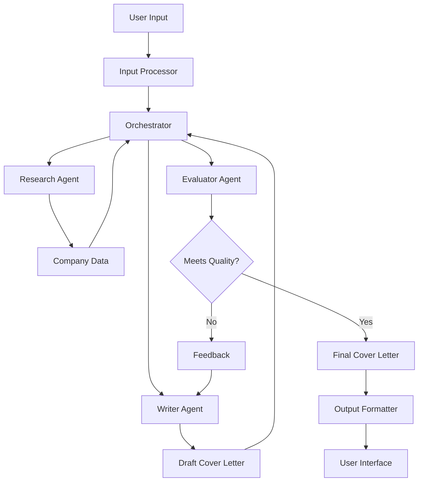
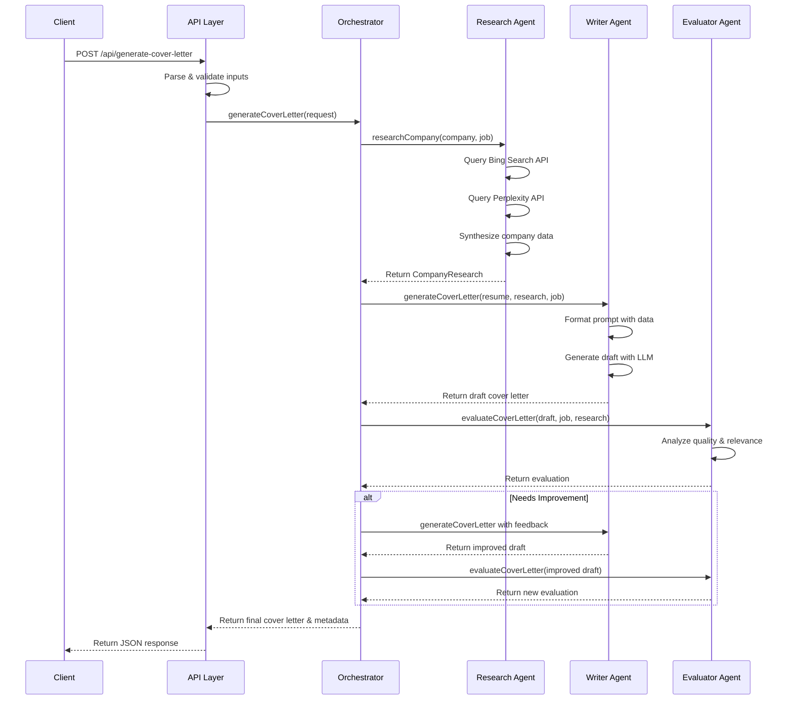
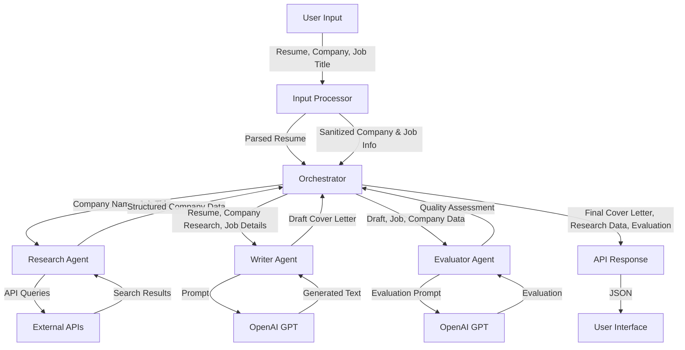

# Cover Letter Generation Agent - Detailed Design Document

## 1. Introduction

This document outlines the detailed design for an agentic cover letter generation system built with TypeScript and LangChain. The system automates the creation of personalized cover letters by leveraging AI-driven research, content drafting, and evaluation.

## 2. System Architecture

### 2.1 High-Level Architecture

The system follows an orchestrator-workers pattern with three specialized agents working together:



### 2.2 Component Overview

1. **Input Processor**: Handles parsing and sanitization of user inputs (resume, job details)
2. **Orchestrator**: Coordinates the workflow between agents
3. **Research Agent**: Gathers company information and relevant insights
4. **Writer Agent**: Drafts the cover letter based on research and resume data
5. **Evaluator Agent**: Reviews the draft for quality and relevance
6. **Output Formatter**: Prepares the final cover letter in the requested format

## 3. Technology Stack

### 3.1 Core Technologies

- **Language**: TypeScript
- **Framework**: Node.js with Express
- **LLM Orchestration**: LangChain.js
- **LLM Provider**: OpenAI GPT
- **Search APIs**: Bing Search API, Perplexity API
- **Document Processing**: pdf-parse (for PDFs), mammoth (for DOCX)
- **Testing**: Jest
- **Containerization**: Docker
- **CI/CD**: GitHub Actions

### 3.2 Key Dependencies

```json
{
  "dependencies": {
    "langchain": "^0.0.x",
    "@langchain/openai": "^0.0.x",
    "express": "^4.18.x",
    "pdf-parse": "^1.1.x",
    "mammoth": "^1.5.x",
    "axios": "^1.6.x",
    "zod": "^3.22.x",
    "winston": "^3.11.x"
  },
  "devDependencies": {
    "typescript": "^5.3.x",
    "jest": "^29.7.x",
    "@types/express": "^4.17.x",
    "@types/jest": "^29.5.x",
    "ts-jest": "^29.1.x",
    "supertest": "^6.3.x"
  }
}
```

## 4. Detailed Component Design

### 4.1 Input Processor

#### 4.1.1 Resume Parser

```typescript
// src/utils/resumeParser.ts
import * as pdfParse from 'pdf-parse';
import * as mammoth from 'mammoth';
import { z } from 'zod';

// Define schema for parsed resume data
export const ResumeSchema = z.object({
  personalInfo: z.object({
    name: z.string(),
    email: z.string().email().optional(),
    phone: z.string().optional(),
    location: z.string().optional(),
  }),
  experience: z.array(
    z.object({
      title: z.string(),
      company: z.string(),
      duration: z.string().optional(),
      description: z.string().optional(),
    })
  ),
  education: z.array(
    z.object({
      degree: z.string(),
      institution: z.string(),
      year: z.string().optional(),
    })
  ),
  skills: z.array(z.string()).optional(),
});

export type Resume = z.infer<typeof ResumeSchema>;

export class ResumeParser {
  async parseFromPDF(buffer: Buffer): Promise<Resume> {
    const data = await pdfParse(buffer);
    return this.extractResumeData(data.text);
  }

  async parseFromDOCX(buffer: Buffer): Promise<Resume> {
    const result = await mammoth.extractRawText({ buffer });
    return this.extractResumeData(result.value);
  }

  parseFromJSON(json: string): Resume {
    const parsed = JSON.parse(json);
    return ResumeSchema.parse(parsed);
  }

  private extractResumeData(text: string): Resume {
    // Implementation would use NLP or regex patterns to extract structured data
    // This is a simplified placeholder

    // In a real implementation, we would use more sophisticated parsing
    // potentially leveraging LLMs to extract structured data from text

    return {
      personalInfo: {
        name: 'Extracted Name',
        email: 'example@email.com',
      },
      experience: [
        {
          title: 'Extracted Job Title',
          company: 'Extracted Company',
          description: 'Extracted description of responsibilities',
        },
      ],
      education: [
        {
          degree: 'Extracted Degree',
          institution: 'Extracted University',
        },
      ],
      skills: ['Extracted Skill 1', 'Extracted Skill 2'],
    };
  }
}
```

#### 4.1.2 Input Sanitizer

```typescript
// src/utils/inputSanitizer.ts

export class InputSanitizer {
  sanitizeText(input: string, maxLength: number = 5000): string {
    // Remove HTML tags
    let sanitized = input.replace(/<[^>]*>?/gm, '');

    // Remove excessive whitespace
    sanitized = sanitized.replace(/\s+/g, ' ').trim();

    // Truncate if too long
    if (sanitized.length > maxLength) {
      sanitized = sanitized.substring(0, maxLength);
    }

    return sanitized;
  }

  sanitizeCompanyName(name: string): string {
    // Remove special characters that might interfere with API calls
    return this.sanitizeText(name, 100)
      .replace(/[^\w\s]/gi, '')
      .trim();
  }

  sanitizeJobTitle(title: string): string {
    return this.sanitizeText(title, 200);
  }

  sanitizeJobDescription(description: string): string {
    return this.sanitizeText(description, 2000);
  }
}
```

### 4.2 Research Agent

#### 4.2.1 Search API Clients

```typescript
// src/agents/research/searchClients.ts
import axios from 'axios';

export interface SearchResult {
  title: string;
  snippet: string;
  url: string;
}

export class BingSearchClient {
  private apiKey: string;
  private baseUrl = 'https://api.bing.microsoft.com/v7.0/search';

  constructor(apiKey: string) {
    this.apiKey = apiKey;
  }

  async search(query: string, count: number = 10): Promise<SearchResult[]> {
    try {
      const response = await axios.get(this.baseUrl, {
        headers: {
          'Ocp-Apim-Subscription-Key': this.apiKey,
        },
        params: {
          q: query,
          count,
        },
      });

      return response.data.webPages.value.map((result: any) => ({
        title: result.name,
        snippet: result.snippet,
        url: result.url,
      }));
    } catch (error) {
      console.error('Bing Search API error:', error);
      return [];
    }
  }
}

export class PerplexityClient {
  private apiKey: string;
  private baseUrl = 'https://api.perplexity.ai/search';

  constructor(apiKey: string) {
    this.apiKey = apiKey;
  }

  async search(query: string): Promise<string> {
    try {
      const response = await axios.post(
        this.baseUrl,
        { query },
        {
          headers: {
            Authorization: `Bearer ${this.apiKey}`,
            'Content-Type': 'application/json',
          },
        }
      );

      return response.data.answer;
    } catch (error) {
      console.error('Perplexity API error:', error);
      return '';
    }
  }
}
```

#### 4.2.2 Research Agent Implementation

````typescript
// src/agents/research/researchAgent.ts
import { ChatOpenAI } from '@langchain/openai';
import { PromptTemplate } from '@langchain/core/prompts';
import {
  BingSearchClient,
  PerplexityClient,
  SearchResult,
} from './searchClients';
import { z } from 'zod';

// Define schema for company research data
export const CompanyResearchSchema = z.object({
  companyName: z.string(),
  mission: z.string().optional(),
  values: z.array(z.string()).optional(),
  recentNews: z
    .array(
      z.object({
        title: z.string(),
        summary: z.string(),
        url: z.string().optional(),
      })
    )
    .optional(),
  industryTrends: z.array(z.string()).optional(),
  keyInsights: z.array(z.string()),
  companySize: z.string().optional(),
  founded: z.string().optional(),
  headquarters: z.string().optional(),
});

export type CompanyResearch = z.infer<typeof CompanyResearchSchema>;

export class ResearchAgent {
  private bingClient: BingSearchClient;
  private perplexityClient: PerplexityClient;
  private llm: ChatOpenAI;

  constructor(
    bingApiKey: string,
    perplexityApiKey: string,
    openaiApiKey: string
  ) {
    this.bingClient = new BingSearchClient(bingApiKey);
    this.perplexityClient = new PerplexityClient(perplexityApiKey);
    this.llm = new ChatOpenAI({
      openAIApiKey: openaiApiKey,
      modelName: 'gpt-4',
      temperature: 0.2,
    });
  }

  async researchCompany(
    companyName: string,
    jobTitle: string,
    jobDescription?: string
  ): Promise<CompanyResearch> {
    // Step 1: Gather information from Bing Search
    const companyQuery = `${companyName} company mission values about`;
    const newsQuery = `${companyName} recent news last 3 months`;
    const industryQuery = `${companyName} industry trends ${jobTitle}`;

    const [companyResults, newsResults, industryResults] = await Promise.all([
      this.bingClient.search(companyQuery, 5),
      this.bingClient.search(newsQuery, 3),
      this.bingClient.search(industryQuery, 3),
    ]);

    // Step 2: Get deeper insights from Perplexity
    const perplexityQuery = `
      Provide a detailed analysis of ${companyName} as a company.
      Include their mission, values, company culture, and recent developments.
      Also include how they approach roles like "${jobTitle}".
    `;
    const perplexityInsights = await this.perplexityClient.search(
      perplexityQuery
    );

    // Step 3: Synthesize all gathered information using LLM
    const synthesisTemplate = PromptTemplate.fromTemplate(`
      You are a research analyst preparing information for a job applicant.
      Based on the following information about {company_name}, synthesize a comprehensive
      company profile that would be useful for writing a cover letter for a {job_title} position.
      
      Company search results:
      {company_results}
      
      Recent news:
      {news_results}
      
      Industry trends:
      {industry_results}
      
      Perplexity insights:
      {perplexity_insights}
      
      Job description (if available):
      {job_description}
      
      Format your response as a JSON object with the following structure:
      {
        "companyName": "Company name",
        "mission": "Company mission statement",
        "values": ["Value 1", "Value 2", ...],
        "recentNews": [
          {
            "title": "News title",
            "summary": "Brief summary",
            "url": "Source URL"
          },
          ...
        ],
        "industryTrends": ["Trend 1", "Trend 2", ...],
        "keyInsights": ["Key insight 1", "Key insight 2", ...],
        "companySize": "Company size if available",
        "founded": "Founding year if available",
        "headquarters": "HQ location if available"
      }
      
      Ensure all fields are filled with accurate information based on the provided data.
      If certain information is not available, you may omit those fields.
    `);

    const synthesisPrompt = await synthesisTemplate.format({
      company_name: companyName,
      job_title: jobTitle,
      company_results: this.formatSearchResults(companyResults),
      news_results: this.formatSearchResults(newsResults),
      industry_results: this.formatSearchResults(industryResults),
      perplexity_insights: perplexityInsights,
      job_description: jobDescription || 'Not provided',
    });

    const synthesisResult = await this.llm.invoke(synthesisPrompt);

    try {
      // Extract JSON from the response
      const jsonMatch =
        synthesisResult.content.match(/```json\n([\s\S]*?)\n```/) ||
        synthesisResult.content.match(/{[\s\S]*}/);

      const jsonString = jsonMatch
        ? jsonMatch[1] || jsonMatch[0]
        : synthesisResult.content;
      const parsedData = JSON.parse(jsonString);

      // Validate with zod schema
      return CompanyResearchSchema.parse({
        companyName,
        ...parsedData,
      });
    } catch (error) {
      console.error('Error parsing research results:', error);

      // Fallback with minimal data
      return {
        companyName,
        keyInsights: [
          'Company operates in the industry relevant to the job position',
        ],
      };
    }
  }

  private formatSearchResults(results: SearchResult[]): string {
    return results
      .map((r) => `Title: ${r.title}\nSnippet: ${r.snippet}\nURL: ${r.url}\n`)
      .join('\n');
  }
}
````

### 4.3 Writer Agent

```typescript
// src/agents/writer/writerAgent.ts
import { ChatOpenAI } from '@langchain/openai';
import { PromptTemplate } from '@langchain/core/prompts';
import { Resume } from '../../utils/resumeParser';
import { CompanyResearch } from '../research/researchAgent';

export type TonePreference =
  | 'formal'
  | 'conversational'
  | 'enthusiastic'
  | 'balanced';

export interface WriterAgentInput {
  resume: Resume;
  companyResearch: CompanyResearch;
  jobTitle: string;
  jobDescription?: string;
  tonePreference?: TonePreference;
}

export class WriterAgent {
  private llm: ChatOpenAI;

  constructor(openaiApiKey: string) {
    this.llm = new ChatOpenAI({
      openAIApiKey: openaiApiKey,
      modelName: 'gpt-4',
      temperature: 0.7,
    });
  }

  async generateCoverLetter(input: WriterAgentInput): Promise<string> {
    const {
      resume,
      companyResearch,
      jobTitle,
      jobDescription,
      tonePreference = 'balanced',
    } = input;

    // Create a prompt template for cover letter generation
    const coverLetterTemplate = PromptTemplate.fromTemplate(`
      You are a professional cover letter writer helping a job applicant create a compelling cover letter.
      
      # CANDIDATE INFORMATION
      Name: {candidate_name}
      Experience: {experience}
      Education: {education}
      Skills: {skills}
      
      # COMPANY INFORMATION
      Company: {company_name}
      Mission: {company_mission}
      Values: {company_values}
      Key Insights: {company_insights}
      
      # JOB DETAILS
      Job Title: {job_title}
      Job Description: {job_description}
      
      # TONE PREFERENCE
      Desired Tone: {tone}
      
      # INSTRUCTIONS
      Write a compelling cover letter that:
      1. Addresses the hiring manager professionally
      2. Introduces the candidate and their interest in the position
      3. Highlights 2-3 relevant experiences that demonstrate qualifications for the role
      4. Shows knowledge of the company by referencing their mission, values, or recent developments
      5. Explains why the candidate is a good fit for both the role and company culture
      6. Includes a call to action and professional closing
      
      The cover letter should be approximately 300-400 words and maintain a {tone} tone throughout.
      Do not use generic phrases like "I am writing to apply" - be more engaging and specific.
      
      Format the letter professionally with appropriate spacing and paragraphs.
    `);

    // Format the prompt with the input data
    const formattedPrompt = await coverLetterTemplate.format({
      candidate_name: resume.personalInfo.name,
      experience: this.formatExperience(resume.experience),
      education: this.formatEducation(resume.education),
      skills: resume.skills?.join(', ') || 'Not provided',
      company_name: companyResearch.companyName,
      company_mission: companyResearch.mission || 'Not available',
      company_values: companyResearch.values?.join(', ') || 'Not available',
      company_insights: companyResearch.keyInsights.join('\n- '),
      job_title: jobTitle,
      job_description: jobDescription || 'Not provided',
      tone: tonePreference,
    });

    // Generate the cover letter
    const result = await this.llm.invoke(formattedPrompt);
    return result.content.trim();
  }

  private formatExperience(experience: Resume['experience']): string {
    return experience
      .map(
        (exp) =>
          `Title: ${exp.title}\nCompany: ${exp.company}\nDuration: ${
            exp.duration || 'Not specified'
          }\nDescription: ${exp.description || 'Not provided'}`
      )
      .join('\n\n');
  }

  private formatEducation(education: Resume['education']): string {
    return education
      .map(
        (edu) =>
          `Degree: ${edu.degree}\nInstitution: ${edu.institution}\nYear: ${
            edu.year || 'Not specified'
          }`
      )
      .join('\n\n');
  }
}
```

### 4.4 Evaluator Agent

````typescript
// src/agents/evaluator/evaluatorAgent.ts
import { ChatOpenAI } from '@langchain/openai';
import { PromptTemplate } from '@langchain/core/prompts';
import { CompanyResearch } from '../research/researchAgent';

export interface EvaluationResult {
  approved: boolean;
  score: number; // 1-10
  feedback: string[];
  suggestedImprovements?: string[];
}

export class EvaluatorAgent {
  private llm: ChatOpenAI;

  constructor(openaiApiKey: string) {
    this.llm = new ChatOpenAI({
      openAIApiKey: openaiApiKey,
      modelName: 'gpt-4',
      temperature: 0.2,
    });
  }

  async evaluateCoverLetter(
    coverLetter: string,
    jobTitle: string,
    companyResearch: CompanyResearch,
    jobDescription?: string
  ): Promise<EvaluationResult> {
    const evaluationTemplate = PromptTemplate.fromTemplate(`
      You are an expert cover letter evaluator with years of experience in HR and recruitment.
      
      # COVER LETTER TO EVALUATE
      {cover_letter}
      
      # JOB DETAILS
      Job Title: {job_title}
      Job Description: {job_description}
      
      # COMPANY INFORMATION
      Company: {company_name}
      Key Company Insights: {company_insights}
      
      # EVALUATION CRITERIA
      1. Relevance to the job position
      2. Personalization to the company
      3. Clarity and coherence
      4. Grammar and professionalism
      5. Overall impact and persuasiveness
      
      # INSTRUCTIONS
      Evaluate the cover letter based on the criteria above. Provide:
      1. A score from 1-10 for each criterion and an overall score
      2. Specific feedback on strengths and weaknesses
      3. Suggested improvements if needed
      4. A final decision on whether the letter is approved or needs revision
      
      Format your response as a JSON object with the following structure:
      {
        "criteriaScores": {
          "relevance": 0,
          "personalization": 0,
          "clarity": 0,
          "grammar": 0,
          "impact": 0
        },
        "overallScore": 0,
        "strengths": ["strength 1", "strength 2", ...],
        "weaknesses": ["weakness 1", "weakness 2", ...],
        "suggestedImprovements": ["improvement 1", "improvement 2", ...],
        "approved": true/false,
        "feedback": ["feedback 1", "feedback 2", ...]
      }
    `);

    const formattedPrompt = await evaluationTemplate.format({
      cover_letter: coverLetter,
      job_title: jobTitle,
      job_description: jobDescription || 'Not provided',
      company_name: companyResearch.companyName,
      company_insights: companyResearch.keyInsights.join('\n- '),
    });

    const result = await this.llm.invoke(formattedPrompt);

    try {
      // Extract JSON from the response
      const jsonMatch =
        result.content.match(/```json\n([\s\S]*?)\n```/) ||
        result.content.match(/{[\s\S]*}/);

      const jsonString = jsonMatch
        ? jsonMatch[1] || jsonMatch[0]
        : result.content;
      const evaluation = JSON.parse(jsonString);

      // Calculate overall score if not provided
      if (!evaluation.overallScore && evaluation.criteriaScores) {
        const scores = Object.values(evaluation.criteriaScores) as number[];
        evaluation.overallScore =
          scores.reduce((a, b) => a + b, 0) / scores.length;
      }

      // Determine if approved based on score if not explicitly provided
      if (evaluation.approved === undefined) {
        evaluation.approved = evaluation.overallScore >= 7;
      }

      return {
        approved: evaluation.approved,
        score: evaluation.overallScore,
        feedback: [
          ...(evaluation.strengths || []),
          ...(evaluation.weaknesses || []),
          ...(evaluation.feedback || []),
        ],
        suggestedImprovements: evaluation.suggestedImprovements,
      };
    } catch (error) {
      console.error('Error parsing evaluation results:', error);

      // Fallback evaluation
      return {
        approved: false,
        score: 5,
        feedback: ['Error processing evaluation. Please try again.'],
      };
    }
  }
}
````

### 4.5 Orchestrator

```typescript
// src/orchestrator.ts
import {
  ResearchAgent,
  CompanyResearch,
} from './agents/research/researchAgent';
import { WriterAgent } from './agents/writer/writerAgent';
import {
  EvaluatorAgent,
  EvaluationResult,
} from './agents/evaluator/evaluatorAgent';
import { Resume } from './utils/resumeParser';
import { InputSanitizer } from './utils/inputSanitizer';

export interface CoverLetterRequest {
  resume: Resume;
  companyName: string;
  jobTitle: string;
  jobDescription?: string;
  tonePreference?: 'formal' | 'conversational' | 'enthusiastic' | 'balanced';
}

export interface CoverLetterResult {
  coverLetter: string;
  companyResearch: CompanyResearch;
  evaluation: EvaluationResult;
  iterations: number;
}

export class Orchestrator {
  private researchAgent: ResearchAgent;
  private writerAgent: WriterAgent;
  private evaluatorAgent: EvaluatorAgent;
  private sanitizer: InputSanitizer;
  private maxIterations: number;

  constructor(
    researchAgent: ResearchAgent,
    writerAgent: WriterAgent,
    evaluatorAgent: EvaluatorAgent,
    maxIterations: number = 3
  ) {
    this.researchAgent = researchAgent;
    this.writerAgent = writerAgent;
    this.evaluatorAgent = evaluatorAgent;
    this.sanitizer = new InputSanitizer();
    this.maxIterations = maxIterations;
  }

  async generateCoverLetter(
    request: CoverLetterRequest
  ): Promise<CoverLetterResult> {
    // Sanitize inputs
    const sanitizedCompanyName = this.sanitizer.sanitizeCompanyName(
      request.companyName
    );
    const sanitizedJobTitle = this.sanitizer.sanitizeJobTitle(request.jobTitle);
    const sanitizedJobDescription = request.jobDescription
      ? this.sanitizer.sanitizeJobDescription(request.jobDescription)
      : undefined;

    // Step 1: Research the company
    console.log(`Researching company: ${sanitizedCompanyName}`);
    const companyResearch = await this.researchAgent.researchCompany(
      sanitizedCompanyName,
      sanitizedJobTitle,
      sanitizedJobDescription
    );

    // Step 2: Generate initial cover letter draft
    console.log('Generating initial cover letter draft');
    let currentDraft = await this.writerAgent.generateCoverLetter({
      resume: request.resume,
      companyResearch,
      jobTitle: sanitizedJobTitle,
      jobDescription: sanitizedJobDescription,
      tonePreference: request.tonePreference,
    });

    // Step 3: Evaluate and refine in a feedback loop
    let currentEvaluation: EvaluationResult;
    let iterations = 1;

    do {
      console.log(`Evaluating draft (iteration ${iterations})`);
      currentEvaluation = await this.evaluatorAgent.evaluateCoverLetter(
        currentDraft,
        sanitizedJobTitle,
        companyResearch,
        sanitizedJobDescription
      );

      if (!currentEvaluation.approved && iterations < this.maxIterations) {
        console.log(
          `Refining draft based on feedback: ${currentEvaluation.feedback.join(
            ', '
          )}`
        );

        // Create an improved prompt incorporating the feedback
        currentDraft = await this.writerAgent.generateCoverLetter({
          resume: request.resume,
          companyResearch,
          jobTitle: sanitizedJobTitle,
          jobDescription: sanitizedJobDescription,
          tonePreference: request.tonePreference,
        });

        iterations++;
      }
    } while (!currentEvaluation.approved && iterations < this.maxIterations);

    return {
      coverLetter: currentDraft,
      companyResearch,
      evaluation: currentEvaluation,
      iterations,
    };
  }
}
```

### 4.6 API Layer

```typescript
// src/controllers/coverLetterController.ts
import { Request, Response } from 'express';
import { Orchestrator, CoverLetterRequest } from '../orchestrator';
import { ResumeParser } from '../utils/resumeParser';

export class CoverLetterController {
  private orchestrator: Orchestrator;
  private resumeParser: ResumeParser;

  constructor(orchestrator: Orchestrator) {
    this.orchestrator = orchestrator;
    this.resumeParser = new ResumeParser();
  }

  async generateCoverLetter(req: Request, res: Response): Promise<void> {
    try {
      const { companyName, jobTitle, jobDescription, tonePreference } =
        req.body;

      if (!companyName || !jobTitle) {
        res
          .status(400)
          .json({ error: 'Company name and job title are required' });
        return;
      }

      // Parse resume from request
      let resume;
      if (req.file) {
        const buffer = req.file.buffer;
        const fileType = req.file.mimetype;

        if (fileType === 'application/pdf') {
          resume = await this.resumeParser.parseFromPDF(buffer);
        } else if (
          fileType ===
          'application/vnd.openxmlformats-officedocument.wordprocessingml.document'
        ) {
          resume = await this.resumeParser.parseFromDOCX(buffer);
        } else if (fileType === 'application/json') {
          resume = this.resumeParser.parseFromJSON(buffer.toString());
        } else {
          res.status(400).json({ error: 'Unsupported file format' });
          return;
        }
      } else if (req.body.resume) {
        // If resume is provided as JSON in the request body
        resume = req.body.resume;
      } else {
        res.status(400).json({ error: 'Resume is required' });
        return;
      }

      // Generate cover letter
      const request: CoverLetterRequest = {
        resume,
        companyName,
        jobTitle,
        jobDescription,
        tonePreference,
      };

      const result = await this.orchestrator.generateCoverLetter(request);

      res.status(200).json({
        coverLetter: result.coverLetter,
        companyResearch: result.companyResearch,
        evaluation: {
          score: result.evaluation.score,
          feedback: result.evaluation.feedback,
        },
        iterations: result.iterations,
      });
    } catch (error) {
      console.error('Error generating cover letter:', error);
      res.status(500).json({ error: 'Failed to generate cover letter' });
    }
  }
}
```

## 5. Application Setup and Configuration

### 5.1 Server Setup

```typescript
// src/index.ts
import express from 'express';
import multer from 'multer';
import dotenv from 'dotenv';
import { CoverLetterController } from './controllers/coverLetterController';
import { ResearchAgent } from './agents/research/researchAgent';
import { WriterAgent } from './agents/writer/writerAgent';
import { EvaluatorAgent } from './agents/evaluator/evaluatorAgent';
import { Orchestrator } from './orchestrator';

// Load environment variables
dotenv.config();

// Initialize Express app
const app = express();
const port = process.env.PORT || 3000;

// Configure middleware
app.use(express.json());
app.use(express.urlencoded({ extended: true }));

// Configure multer for file uploads
const upload = multer({
  storage: multer.memoryStorage(),
  limits: {
    fileSize: 10 * 1024 * 1024, // 10MB limit
  },
});

// Initialize agents
const researchAgent = new ResearchAgent(
  process.env.BING_API_KEY || '',
  process.env.PERPLEXITY_API_KEY || '',
  process.env.OPENAI_API_KEY || ''
);

const writerAgent = new WriterAgent(process.env.OPENAI_API_KEY || '');

const evaluatorAgent = new EvaluatorAgent(process.env.OPENAI_API_KEY || '');

// Initialize orchestrator
const orchestrator = new Orchestrator(
  researchAgent,
  writerAgent,
  evaluatorAgent
);

// Initialize controller
const coverLetterController = new CoverLetterController(orchestrator);

// Define routes
app.post('/api/generate-cover-letter', upload.single('resume'), (req, res) =>
  coverLetterController.generateCoverLetter(req, res)
);

// Health check endpoint
app.get('/health', (req, res) => {
  res.status(200).json({ status: 'ok' });
});

// Start server
app.listen(port, () => {
  console.log(`Server running on port ${port}`);
});
```

### 5.2 Environment Configuration

```
# .env.example
# API Keys
OPENAI_API_KEY=your_openai_api_key
BING_API_KEY=your_bing_api_key
PERPLEXITY_API_KEY=your_perplexity_api_key

# Server Configuration
PORT=3000
NODE_ENV=development

# Optional: Database Configuration (if using)
# DB_CONNECTION_STRING=your_connection_string
```

## 6. Data Flow and Sequence Diagrams

### 6.1 Cover Letter Generation Sequence



### 6.2 Data Flow Diagram



## 7. Error Handling and Resilience

### 7.1 Error Types and Handling Strategies

| Error Type           | Handling Strategy                                                          |
| -------------------- | -------------------------------------------------------------------------- |
| **API Rate Limits**  | Implement exponential backoff and retry logic for external API calls       |
| **Invalid Inputs**   | Validate all inputs with Zod schemas and return clear error messages       |
| **LLM API Failures** | Implement fallback mechanisms (e.g., cached templates, alternative models) |
| **Parsing Errors**   | Provide graceful degradation with partial data extraction                  |
| **Network Issues**   | Implement timeouts and circuit breakers for external services              |

### 7.2 Resilience Implementation

```typescript
// src/utils/resilience.ts
export class RetryStrategy {
  private maxRetries: number;
  private baseDelay: number;

  constructor(maxRetries: number = 3, baseDelay: number = 1000) {
    this.maxRetries = maxRetries;
    this.baseDelay = baseDelay;
  }

  async execute<T>(operation: () => Promise<T>): Promise<T> {
    let lastError: Error | undefined;

    for (let attempt = 0; attempt <= this.maxRetries; attempt++) {
      try {
        return await operation();
      } catch (error) {
        lastError = error as Error;

        if (attempt < this.maxRetries) {
          // Exponential backoff with jitter
          const delay =
            this.baseDelay * Math.pow(2, attempt) * (0.5 + Math.random() * 0.5);
          console.log(`Retry attempt ${attempt + 1} after ${delay}ms`);
          await new Promise((resolve) => setTimeout(resolve, delay));
        }
      }
    }

    throw lastError;
  }
}

export class CircuitBreaker {
  private failureThreshold: number;
  private resetTimeout: number;
  private failureCount: number = 0;
  private isOpen: boolean = false;
  private lastFailureTime: number = 0;

  constructor(failureThreshold: number = 5, resetTimeout: number = 30000) {
    this.failureThreshold = failureThreshold;
    this.resetTimeout = resetTimeout;
  }

  async execute<T>(operation: () => Promise<T>): Promise<T> {
    if (this.isOpen) {
      // Check if circuit should be half-open
      const timeSinceLastFailure = Date.now() - this.lastFailureTime;
      if (timeSinceLastFailure > this.resetTimeout) {
        this.isOpen = false;
        this.failureCount = 0;
      } else {
        throw new Error('Circuit breaker is open');
      }
    }

    try {
      const result = await operation();
      this.failureCount = 0;
      return result;
    } catch (error) {
      this.failureCount++;
      this.lastFailureTime = Date.now();

      if (this.failureCount >= this.failureThreshold) {
        this.isOpen = true;
        console.log('Circuit breaker opened');
      }

      throw error;
    }
  }
}
```

## 8. Testing Strategy

### 8.1 Unit Testing

```typescript
// tests/agents/writer/writerAgent.test.ts
import { WriterAgent } from '../../../src/agents/writer/writerAgent';
import { CompanyResearch } from '../../../src/agents/research/researchAgent';
import { Resume } from '../../../src/utils/resumeParser';

// Mock the OpenAI API
jest.mock('@langchain/openai', () => ({
  ChatOpenAI: jest.fn().mockImplementation(() => ({
    invoke: jest.fn().mockResolvedValue({
      content: 'This is a mock cover letter for testing purposes.',
    }),
  })),
}));

describe('WriterAgent', () => {
  let writerAgent: WriterAgent;
  let mockResume: Resume;
  let mockCompanyResearch: CompanyResearch;

  beforeEach(() => {
    writerAgent = new WriterAgent('fake-api-key');

    mockResume = {
      personalInfo: {
        name: 'John Doe',
        email: 'john@example.com',
      },
      experience: [
        {
          title: 'Software Engineer',
          company: 'Tech Corp',
          description: 'Developed web applications',
        },
      ],
      education: [
        {
          degree: 'Computer Science',
          institution: 'University',
        },
      ],
      skills: ['JavaScript', 'TypeScript'],
    };

    mockCompanyResearch = {
      companyName: 'Example Inc',
      mission: 'To innovate',
      keyInsights: ['Growing tech company', 'Focus on AI'],
    };
  });

  test('should generate a cover letter', async () => {
    const result = await writerAgent.generateCoverLetter({
      resume: mockResume,
      companyResearch: mockCompanyResearch,
      jobTitle: 'Senior Developer',
    });

    expect(result).toBeDefined();
    expect(typeof result).toBe('string');
    expect(result.length).toBeGreaterThan(0);
  });

  test('should handle different tone preferences', async () => {
    const tones: Array<
      'formal' | 'conversational' | 'enthusiastic' | 'balanced'
    > = ['formal', 'conversational', 'enthusiastic', 'balanced'];

    for (const tone of tones) {
      const result = await writerAgent.generateCoverLetter({
        resume: mockResume,
        companyResearch: mockCompanyResearch,
        jobTitle: 'Senior Developer',
        tonePreference: tone,
      });

      expect(result).toBeDefined();
    }
  });
});
```

### 8.2 Integration Testing

```typescript
// tests/integration/coverLetterGeneration.test.ts
import request from 'supertest';
import express from 'express';
import { CoverLetterController } from '../../src/controllers/coverLetterController';
import { Orchestrator } from '../../src/orchestrator';

// Mock the orchestrator and its dependencies
jest.mock('../../src/orchestrator');

describe('Cover Letter Generation API', () => {
  let app: express.Application;
  let mockOrchestrator: jest.Mocked<Orchestrator>;

  beforeEach(() => {
    app = express();
    app.use(express.json());

    mockOrchestrator = new Orchestrator(
      {} as any,
      {} as any,
      {} as any
    ) as jest.Mocked<Orchestrator>;

    mockOrchestrator.generateCoverLetter.mockResolvedValue({
      coverLetter: 'Test cover letter content',
      companyResearch: {
        companyName: 'Test Company',
        keyInsights: ['Insight 1', 'Insight 2'],
      },
      evaluation: {
        approved: true,
        score: 8.5,
        feedback: ['Good structure', 'Well personalized'],
      },
      iterations: 1,
    });

    const controller = new CoverLetterController(mockOrchestrator);

    app.post('/api/generate-cover-letter', (req, res) =>
      controller.generateCoverLetter(req, res)
    );
  });

  test('should generate a cover letter with valid inputs', async () => {
    const response = await request(app)
      .post('/api/generate-cover-letter')
      .send({
        resume: {
          personalInfo: { name: 'Test User' },
          experience: [{ title: 'Developer', company: 'Tech Co' }],
          education: [{ degree: 'CS', institution: 'University' }],
        },
        companyName: 'Target Company',
        jobTitle: 'Senior Developer',
      });

    expect(response.status).toBe(200);
    expect(response.body).toHaveProperty('coverLetter');
    expect(response.body).toHaveProperty('companyResearch');
    expect(response.body).toHaveProperty('evaluation');
  });

  test('should return 400 for missing required fields', async () => {
    const response = await request(app)
      .post('/api/generate-cover-letter')
      .send({
        resume: {
          personalInfo: { name: 'Test User' },
          experience: [],
          education: [],
        },
        // Missing companyName and jobTitle
      });

    expect(response.status).toBe(400);
  });
});
```

## 9. Deployment and DevOps

### 9.1 Docker Configuration

```dockerfile
# Dockerfile
FROM node:18-alpine

WORKDIR /app

# Copy package files and install dependencies
COPY package*.json ./
RUN npm ci --only=production

# Copy application code
COPY dist/ ./dist/

# Set environment variables
ENV NODE_ENV=production
ENV PORT=3000

# Expose the application port
EXPOSE 3000

# Start the application
CMD ["node", "dist/index.js"]
```

### 9.2 CI/CD Pipeline (GitHub Actions)

```yaml
# .github/workflows/ci-cd.yml
name: CI/CD Pipeline

on:
  push:
    branches: [main]
  pull_request:
    branches: [main]

jobs:
  test:
    runs-on: ubuntu-latest
    steps:
      - uses: actions/checkout@v3
      - name: Use Node.js
        uses: actions/setup-node@v3
        with:
          node-version: '18'
          cache: 'npm'
      - run: npm ci
      - run: npm run lint
      - run: npm test

  build:
    needs: test
    runs-on: ubuntu-latest
    if: github.event_name == 'push' && github.ref == 'refs/heads/main'
    steps:
      - uses: actions/checkout@v3
      - name: Use Node.js
        uses: actions/setup-node@v3
        with:
          node-version: '18'
          cache: 'npm'
      - run: npm ci
      - run: npm run build
      - name: Upload build artifacts
        uses: actions/upload-artifact@v3
        with:
          name: build-artifacts
          path: dist/

  deploy:
    needs: build
    runs-on: ubuntu-latest
    if: github.event_name == 'push' && github.ref == 'refs/heads/main'
    steps:
      - uses: actions/checkout@v3
      - name: Download build artifacts
        uses: actions/download-artifact@v3
        with:
          name: build-artifacts
          path: dist/
      - name: Set up Docker Buildx
        uses: docker/setup-buildx-action@v2
      - name: Login to DockerHub
        uses: docker/login-action@v2
        with:
          username: ${{ secrets.DOCKERHUB_USERNAME }}
          password: ${{ secrets.DOCKERHUB_TOKEN }}
      - name: Build and push Docker image
        uses: docker/build-push-action@v4
        with:
          context: .
          push: true
          tags: yourusername/cover-letter-agent:latest
```

## 10. Future Enhancements

### 10.1 Potential Improvements

1. **Enhanced Resume Parsing**

   - Implement more sophisticated resume parsing using specialized NLP models
   - Support more file formats and better structure extraction

2. **Expanded Research Capabilities**

   - Add integration with more data sources (LinkedIn, Glassdoor, etc.)
   - Implement caching for frequently researched companies

3. **User Feedback Loop**

   - Add a mechanism for users to provide feedback on generated cover letters
   - Use this feedback to improve the system over time

4. **Multilingual Support**

   - Extend the system to support multiple languages
   - Add translation capabilities for international job applications

5. **Advanced Customization**
   - Allow users to specify industry-specific requirements
   - Implement templates for different career stages and job types

### 10.2 Scaling Considerations

1. **Performance Optimization**

   - Implement caching for research results and common queries
   - Consider using smaller, specialized models for specific tasks

2. **Cost Management**

   - Implement tiered usage plans based on API consumption
   - Optimize prompts to reduce token usage

3. **Horizontal Scaling**
   - Design the system to be stateless for easy horizontal scaling
   - Implement a queue system for handling high volumes of requests

## 11. Conclusion

This design document outlines a comprehensive approach to building an agentic cover letter generation system using TypeScript and LangChain. The system leverages the orchestrator-workers pattern with three specialized agents (Research, Writer, and Evaluator) working together to produce high-quality, personalized cover letters.

The architecture prioritizes modularity, error resilience, and testability, making it suitable for production deployment. By following the implementation details provided in this document, developers can build a robust system that meets the requirements specified in the original specification document.
